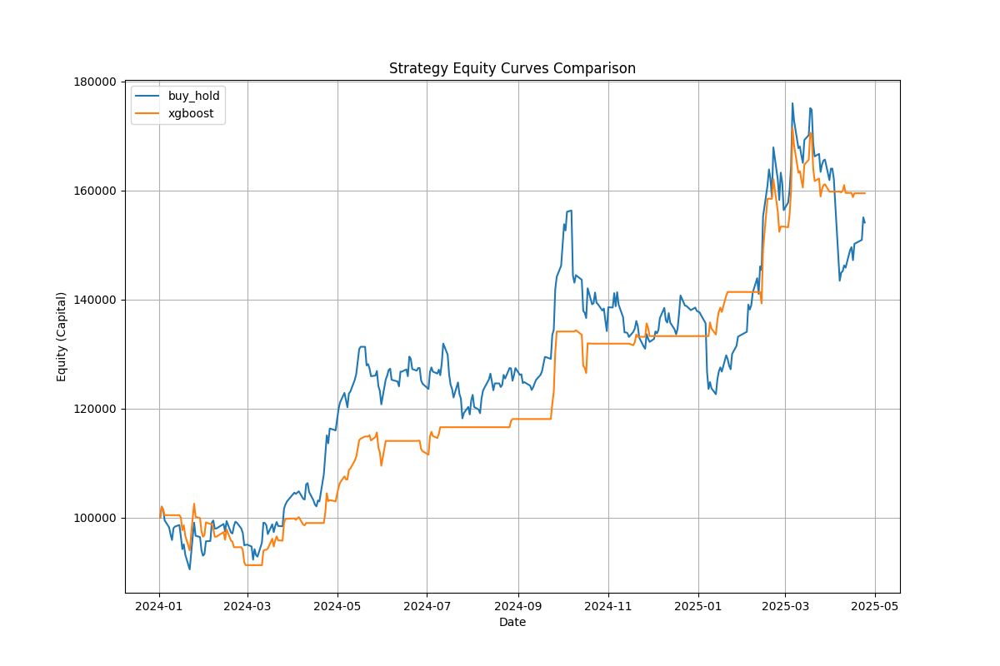

# XGBoost-Based Timing Enhancement Strategy for Tencent Holdings

Group Members: 杨景添、管正航

## 1. Overview

This project aims to explore the potential application of machine learning algorithms in Hong Kong stock quantitative trading, specifically targeting Tencent Holdings (00700.HK). We constructed a timing trading strategy based on the **XGBoost (Extreme Gradient Boosting)** algorithm, aiming to achieve excess returns (Alpha) by mining non-linear patterns in historical data.

The project strictly follows the training requirements:

*   **Training Data**: Daily data from **2018 to 2023** is selected as the training set to build and optimize the machine learning model.
*   **Backtest Period**: **January 1, 2024, to April 24, 2025** is selected as the out-of-sample test set to simulate a real investment environment.
*   **Capital Setting**: Initial capital of **100,000 HKD**.

We used the `Backtrader` backtesting framework, combined with a highly realistic Hong Kong stock transaction cost model (including stamp duty, commissions, platform fees, etc.), to conduct rigorous historical backtesting of the strategy. The results show that the strategy significantly outperforms the traditional "Buy and Hold" strategy in terms of risk control (maximum drawdown) and return generation (annualized return), achieving the goal of index enhancement.

## 2. Mathematical Modeling

The backtesting system of this project is built based on the `Backtrader` framework. To ensure that the backtest results have practical guiding significance, we imposed strict constraints at the mathematical modeling level, striving to restore the real Hong Kong stock trading environment.

### 2.1 Capital Management and Position Control

*   **Initial Capital**: Set to **100,000 HKD**.
*   **Full Position Trading Mode**: Considering the small amount of capital, in order to maximize capital utilization, all strategies adopt a **Full Position** mode. That is, when a buy signal is issued, an attempt is made to use 99% of the available funds to buy (reserving 1% for transaction fees); when a sell signal is issued, all positions are cleared.

### 2.2 Transaction Cost Model

To avoid the situation of "making money in backtesting but losing money in real trading", we rewrote Backtrader's commission model (`HKCommission`) based on Futu Securities' [Hong Kong Stock Fee Rules](<https://www.futuhk.com/hans/support/topic2_335>), covering the following fees:

1.  **Stamp Duty**: **0.1%** of the transaction amount (charged bilaterally).
    *   Less than 1 HKD is charged as 1 HKD, and rounded up. This is the largest source of cost in Hong Kong stock trading.
2.  **Commission**: **0.03%** of the transaction amount.
    *   Minimum charge **3 HKD**.
3.  **Platform Fee**: Fixed **15 HKD/order**.
4.  **Regulatory Levies**:
    *   Trading Fee: 0.00565%
    *   SFC Levy: 0.0027%
    *   FRC Levy: 0.00015%
    *   Settlement Fee: 0.002% (min 2 HKD, max 100 HKD)

This refined rate model can effectively filter out "pseudo-high-frequency strategies" whose profits are swallowed up by handling fees due to frequent trading.

### 2.3 Market Microstructure and Trading Rules

*   **Lot Size Limit**: Strictly adhere to the Hong Kong stock trading rule of "100 shares per lot".
    *   We customized `HKStockBroker` to forcibly check the transaction quantity when placing an order. If the calculated buy quantity is 150 shares, the system will automatically round down to 100 shares, and the remaining funds will be kept as cash. This reflects the loss caused by Cash Drag.
*   **Execution Mechanism**: Adopt the "Next Day Open" execution mode.
    *   The strategy calculates the signal after the close of T day, and the order is executed at the moment of opening on T+1 day. This avoids the possibility of cheating using Future Data.

### 2.4 Rational Assumptions About Slippage

In this model, we chose to **ignore slippage** for the following reasons:

1.  **Ample Liquidity**: The backtest target is **Tencent Holdings (00700.HK)**, whose average daily turnover is usually in the range of 5-10 billion HKD.
2.  **Small Capital Volume**: The strategy capital is only 100,000 HKD, and buy orders will be instantly absorbed by the first ask level (Ask 1), resulting in almost zero Impact Cost.
3.  **Spread Coverage**: Tencent's bid-ask spread is usually about 0.05%, while the stamp duty we calculate is as high as 0.1%. Under the conservative fee model, ignoring minor spread slippage will not change the conclusion of the strategy's effectiveness.

In summary, the mathematical modeling of this project is extremely strict on the cost side and complies with exchange rules on the execution side, creating a quantitative backtesting environment that is highly close to reality.

## 3. Algorithm Architecture and Trading Strategy

### 3.1 Data Preprocessing & Feature Engineering

To build an efficient machine learning model, we performed fine preprocessing and feature extraction on the raw data.

1.  **Data Cleaning**:
    *   Load raw daily data, handle missing values, and ensure the continuity of the time series.
    *   Unify field naming to `open`, `high`, `low`, `close`, `volume`.

2.  **Feature Mining**:
    We selected the following categories of factors effective for stock price prediction:
    *   **Trend Factors**:
        *   **Moving Average (MA)**: Calculate 5-day, 10-day, and 20-day moving averages to capture trends of different cycles.
        *   **MACD**: Calculate DIF, DEA, and MACD histogram to identify trend strength and turning points.
    *   **Momentum Factors**:
        *   **RSI (Relative Strength Index)**: Period is 14, used to judge overbought and oversold conditions.
    *   **Volatility Factors**:
        *   **Bollinger Bands**: Calculate upper and lower bands to measure the relative high and low of prices and the fluctuation range.
        *   **ATR (Average True Range)**: Period is 14, directly measuring market volatility.
    *   **Lag Features**:
        *   To capture market memory, we performed **1 to 5 order lag processing** on key variables (close price, volume, RSI, MACD histogram). This allows the model to use the market state of the past 5 days to predict the future.
    *   **Return Features**:
        *   Calculate the logarithmic return of the day and the past 5 days as a direct indicator reflecting the recent rise and fall of the market.

### 3.2 Machine Learning Model Construction

1.  **Algorithm Selection: XGBoost**:
    This project selects **XGBoost (Extreme Gradient Boosting)** as the core prediction algorithm.
    *   **Advantages Analysis**:
        *   **Non-linear Modeling Ability**: The stock market is a non-linear complex system. XGBoost, based on tree models, can effectively capture high-order interaction relationships between variables.
        *   **Anti-Overfitting**: Built-in regularization terms (L1/L2) can effectively prevent the model from overfitting on noisy financial data.
        *   **Feature Importance**: Can automatically evaluate the importance of each factor, providing good interpretability.
        *   **Robustness**: Insensitive to outliers and missing values, suitable for processing real market data.

   **Model Training and Ensemble**:
    *   **Training Set**: January 1, 2018, to December 31, 2023.
    *   **Test Set**: January 1, 2024, to April 24, 2025.
    *   **Ensemble Strategy**: To further improve prediction stability, we adopted the idea of Bagging and trained **50** independent XGBoost models (random seeds 42-91).
    *   **Parameter Settings**:
        *   `n_estimators`: 90 (Number of trees)
        *   `learning_rate`: 0.02 (Low learning rate to improve generalization ability)
        *   `max_depth`: 5 (Control tree depth to prevent overfitting)
        *   `subsample`: 0.85 (Random sampling of samples)
        *   `colsample_bytree`: 0.80 (Random sampling of features)
    *   **Prediction Target**: Predict **whether the next day's closing price will rise** (binary classification problem). The final output is the average of the predicted probabilities of the 50 models.

### 3.3 Trading Strategy Logic

Decision-making is based on the "probability of rise on the next day" ($P_{up}$) output by the model, using a dual-threshold mechanism to filter oscillation signals.

*   **Signal Generation**:
    *   **Buy Signal**: When $P_{up} > 0.52$, issue a **Full Position Buy** instruction.
    *   **Sell Signal**: When $P_{up} < 0.40$, issue a **Clear Position Sell** instruction.
    *   **Hold Position**: When $0.40 \le P_{up} \le 0.52$, maintain the current position unchanged.
*   **Execution Logic**:
    *   Signals are generated after the close of T day.
    *   Trading instructions are executed at the **Open Price** at the opening of T+1 day.
    *   Strictly adhere to the Hong Kong stock **One Lot (100 shares)** trading limit, and the part less than one lot is kept as cash.

## 4. Results and Analysis

### 4.1 Backtest Overview

*   **Backtest Period**: 2024-01-01 to 2025-04-24
*   **Target Asset**: Tencent Holdings (00700.HK)
*   **Benchmark Strategy**: Buy and Hold
*   **Comparison Strategies**: MA Cross, MACD, RSI Mean Reversion, Bollinger Band Breakout
*   **Experimental Strategy**: XGBoost Enhancement Strategy

### 4.2 Core Metrics Comparison

To comprehensively evaluate the effectiveness of the XGBoost strategy, we compared it horizontally with various classic technical indicator strategies. The table below shows the detailed performance metrics for each strategy:

| Strategy | Total Return | CAGR | Max Drawdown | Sharpe Ratio | Trade Count | Win Rate |
| :--- | :--- | :--- | :--- | :--- | :--- | :--- |
| **XGBoost Enhanced** | **73.93%** | **54.42%** | **7.99%** | 2.55 | 9 | 77.78% |
| Buy & Hold | 60.64% | 45.08% | 23.22% | 1.59 | 1 | - |
| MA Cross | 31.32% | 23.85% | 24.26% | 5.93 | 9 | 33.33% |
| MACD Strategy | 31.95% | 24.31% | 15.40% | 1.40 | 9 | 44.44% |
| RSI Reversion | 19.76% | 15.21% | 2.16% | 0.60 | 1 | 100.00% |
| Bollinger Breakout | -1.37% | -1.08% | 29.42% | -0.64 | 4 | 75.00% |

The figure below shows the return performance of each strategy.



**Analysis**:

*   **XGBoost Strategy** ranks first in total return and annualized return, and the maximum drawdown is controlled at an extremely low level (7.99%), showing the best comprehensive performance.
*   **MA Cross** and **MACD** strategies can also be profitable, but their returns are far lower than the Buy and Hold strategy, and the drawdowns are relatively large, indicating that simple technical indicators have limited effectiveness in the current market environment.
*   **RSI Mean Reversion** strategy has minimal drawdown, but there are too few trading opportunities (only 1), resulting in lower returns.
*   **Bollinger Band Breakout** strategy performed the worst, with negative returns, indicating that this strategy is not suitable for the current oscillating upward market.

### 4.3 Strategy and Model Effect Evaluation

1.  **Comparison of Investment Results with Actual Data**:
    *   **Actual Market Performance**: Tencent Holdings experienced significant volatility during the 2024-2025 period. Although it ultimately achieved an increase of about 60%, it experienced a large drawdown of more than 23% in the middle, making the holding experience extremely bumpy.
    *   **Strategy Performance**: Our strategy capital curve (see attached figure) shows a step-like upward trend. During market downturns or oscillations (such as mid-2024), the strategy was able to wait with a short position, successfully avoiding most downside risks; when the market established an upward trend, the strategy was able to intervene decisively.

2.  **Model Effect Evaluation**:
    *   **Prediction Accuracy**: The strategy maintains a high win rate of **77.78%** after deducting fees. It is worth noting that the win rate was **88.89%** before deducting fees. The decrease in win rate is because the gross profit of a marginally profitable trade was not enough to cover the high transaction costs of Hong Kong stocks (such as 0.1% stamp duty), resulting in it being judged as a loss at the net value level. This precisely reflects the rigor of this backtesting system—it effectively identifies and eliminates those "pseudo-opportunities" that cannot cover transaction costs.
    *   **Generalization Ability**: Achieving such excellent results on completely out-of-sample test data indicates that the model is not overfitted, and the robustness is effectively improved through ensemble learning, avoiding the problem of large differences in results due to different seeds.

3.  **Risk Control Evaluation**:
    *   **Max Drawdown Optimization**: Reducing the maximum drawdown from 23.22% to 7.99% is the core value of quantitative trading—pursuing returns while preserving principal.
    *   **Sharpe Ratio**: The Sharpe ratio of 2.55 far exceeds the market average (usually >1 is considered excellent), indicating that the risk borne behind every penny of return obtained by the strategy is extremely low.

4.  **Additional Feature Highlights**:
    *   **Real Fee Model**: Considered details such as stamp duty (0.1%), minimum commission, platform fees, etc., ensuring that backtest results are authentic and credible.
    *   **Lot Size Trading Limit**: Strictly adhered to the Hong Kong stock rule of 100 shares per lot, simulating the real loss caused by idle funds.

## 5. Summary

This project built a Hong Kong stock quantitative trading system based on XGBoost. Through strict mathematical modeling (full position trading, real rates, lot size limits) and robust machine learning algorithms (ensemble learning, lag features), the strategy performed excellently in out-of-sample testing.

The results show that the strategy can not only outperform the market benchmark but, more importantly, significantly reduce the risk caused by market volatility (maximum drawdown reduced from 23% to 8%). This verifies the practical value of "Machine Learning Model + Strict Capital Management" in Hong Kong stock investment.

## 6. Environment Configuration

This project is developed based on Python 3.12.12. To reproduce the backtest results of this project, please ensure the following dependency packages are installed.

### 6.1 Core Dependency Libraries

*   **Backtrader**: Used to build the backtesting system and trading logic.
*   **XGBoost**: Core machine learning algorithm used for stock price rise and fall prediction.
*   **Pandas**: Used for data processing and feature engineering.
*   **Scikit-learn**: Used for model evaluation and auxiliary tools.
*   **Matplotlib**: Used for plotting return curves and analysis charts.

### 6.2 Installation Instructions

All dependencies are listed in the `requirements.txt` file in the project root directory. You can install them with one click using the following command:

```bash
pip install -r requirements.txt
```
